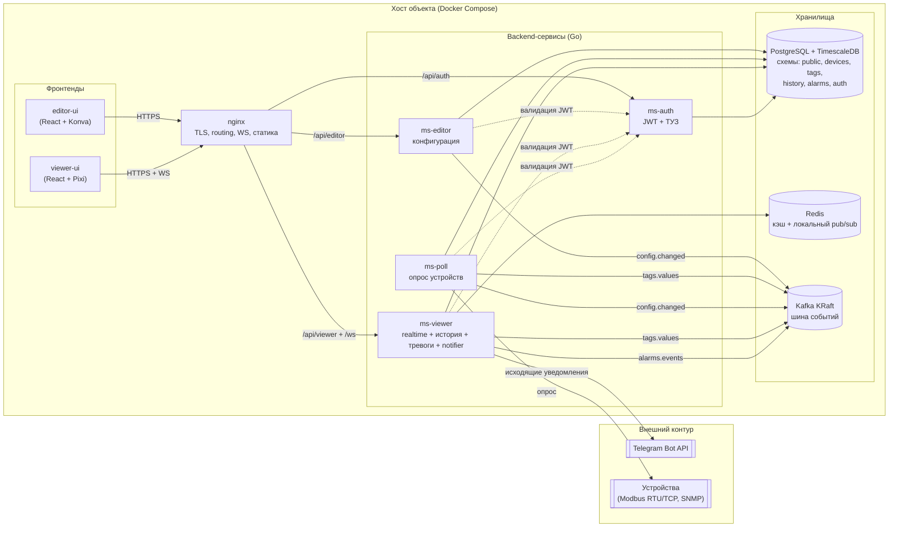

# 2. Архитектура системы — обзор

Controlitix — self-hosted SCADA-платформа для мониторинга инженерной инфраструктуры ЦОД. Архитектура MVP спроектирована под одну инсталляцию на физический хост, Docker Compose, масштаб до ~250 устройств и ~2 500 тегов (см. [`../01_Цель-и-область/НФТ.md`](../01_Цель-и-область/НФТ.md)).

## Компонентная диаграмма (MVP)

## Основные принципы

- **Единая шина событий — Kafka.** Асинхронные потоки (`tags.values`, `alarms.events`, `config.changed`, `audit.logs`) проходят через Kafka. Это даёт буферизацию при сбоях потребителей и независимое чтение одного потока несколькими сервисами. См. [ADR-0010](../08_ADR/ADR-0010-kafka-event-bus.md).
- **Одна БД на инсталляцию, логические схемы.** PostgreSQL с TimescaleDB-extension содержит все данные платформы; разделение на схемы (`public`, `devices`, `tags`, `history`, `alarms`, `auth`) отражает доменные границы и облегчает будущий переход в SaaS. См. [ADR-0003](../08_ADR/ADR-0003-postgres-schemas.md) и [ADR-0004](../08_ADR/ADR-0004-timescaledb-history.md).
- **Конфигурация через `ms-editor`, чтение через `ms-viewer`.** Любое изменение инженерной конфигурации проходит через `ms-editor` и сопровождается событием `config.changed`. `ms-poll` и `ms-viewer` обновляют локальные кэши по этому событию.
- **Realtime через WebSocket.** `ms-viewer` обслуживает WS-подписки от `viewer-ui` и транслирует значения из Kafka клиентам с дребезгом/буферизацией.
- **Gateway — Nginx.** Единая точка входа, TLS, маршрутизация по префиксам, проксирование WebSocket. Nginx не валидирует JWT — это делают backend-сервисы. См. [ADR-0006](../08_ADR/ADR-0006-nginx-gateway.md).
- **Deployment — Docker Compose.** Один хост на объект, один `docker-compose.yml`, один `.env`. См. [ADR-0005](../08_ADR/ADR-0005-docker-compose-mvp.md).

## Разделы

- 2.1 Компоненты и границы — см. эту диаграмму выше и `../Controlitix.drawio` (архивная версия).
- 2.2 [Микросервисы](Микросервисы/README.md) — назначение, стек, границы ответственности, API.
- 2.3 [Хранилища](Хранилища/README.md) — PostgreSQL/TimescaleDB, Redis, Kafka.
- 2.4 [Потоки данных](Потоки-данных.md) — последовательности сценариев «опрос → значение → Viewer», «тревога → notifier» и др.
- 2.5 [Развёртывание](Развёртывание.md) — TBD, Compose-стек, sizing, backup, обновление.
- 2.6 [Безопасность](Безопасность.md) — модель угроз, аутентификация, авторизация, секреты.
- 2.7 [Observability](Observability.md) — TBD, health-чеки, логи, Zabbix agent.

## Связанные документы

- [`../01_Цель-и-область/НФТ.md`](../01_Цель-и-область/НФТ.md) — количественные требования, из которых вытекают архитектурные решения.
- [`../08_ADR/README.md`](../08_ADR/README.md) — список принятых архитектурных решений.
- [`../03_Модель-данных/README.md`](../03_Модель-данных/README.md) — физическая модель данных.
- [`../04_API/README.md`](../04_API/README.md) — API-контракты.
