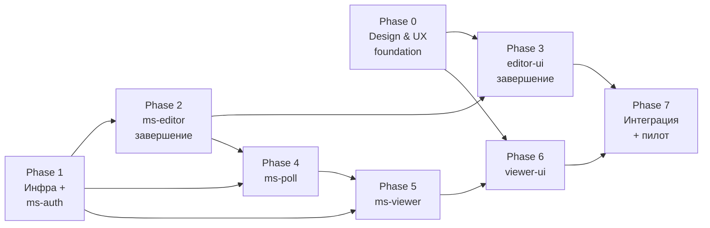

# 9. План работ

Дорожная карта разработки Controlitix MVP. План разбит на фазы с чёткими deliverables, зависимостями и критериями готовности. Фазы допускают частичную параллельную работу — см. раздел «Критический путь».

---

## Статус разработки (апрель 2026)

**Общая готовность MVP: ~27%**

Расчёт: фазы взвешены по трудозатратам (P0=10%, P1=10%, P2=12%, P3=18%, P4=15%, P5=15%, P6=15%, P7=5%). После последних ревью: P2≈80%, P3≈40%, остальные без изменений.

### Покрытие пользовательских сценариев

| Сценарий | Статус | Что работает | Что отсутствует |
|---|:---:|---|---|
| **Инженер: добавить устройство** (Modbus/SNMP) | 🟡 Частично | Backend CRUD устройств и тегов — реализован. Frontend: страница устройств готова, страница тегов в `ready`. | Нет опроса (`ms-poll` не реализован) — теги не получают значений. Публикация `config.changed` есть, но слушателя нет. |
| **Инженер: создать мнемосхему** | 🟡 Частично | Backend: CRUD мнемосхем, фигур, параметров. Frontend: список схем готов. | Canvas-редактор — placeholder. Привязка фигур к тегам, публикация — не реализованы в UI. |
| **Инженер: привязать фигуры к тегам** | 🔴 Не готов | Бэкенд `figures.tag_id` и `figure_params` в схеме БД. | Редактор (спека 0011) не реализован. `ms-viewer` + WebSocket отсутствуют — real-time данных нет. |
| **Инженер: настроить тренды и отчёты** | 🔴 Не готов | — | `ms-viewer` не реализован. История значений не пишется. Viewer UI отсутствует. |
| **Оператор: мониторинг и квитирование тревог** | 🔴 Не готов | `tags.tag_setpoints` в схеме БД. | Движок тревог (`ms-viewer`) не реализован. Viewer UI отсутствует. |
| **Уведомления: Telegram** | 🔴 Не готов | — | Telegram notifier — часть `ms-viewer`, не реализован. |
| **Администратор: управление доступом (RBAC)** | 🔴 Не готов | Схема `auth` в миграциях. | `ms-auth` не реализован. JWT, RBAC middleware, пользователи — отсутствуют. |

**Легенда:** 🟢 Готово end-to-end · 🟡 Частично (бэкенд без UI или UI без данных) · 🔴 Не готов

### Что реально работает сегодня

При поднятом `docker compose up`:

- Инженер может **создать объект**, **добавить устройство** (Modbus TCP/RTU, SNMP v1/v2c/v3), **добавить теги** — через `editor-ui` (страницы Objects, Devices; Tags — `ready`, но Codex ещё не реализовал).
- Конфигурация сохраняется в PostgreSQL, события `config.changed` идут в Kafka.
- Список **мнемосхем** объекта виден и создаётся через UI (страница Diagrams готова).
- Canvas-редактор и привязка фигур — **placeholder**, данных в реальном времени нет.
- Всё остальное (polling, history, alarms, viewer, auth) — **недоступно**.

---

## Принципы планирования

- **MVP под конкретного заказчика.** Всё, что не приближает к пилотному развёртыванию, откладывается.
- **Design first.** Разработка фронтенда не начинается до готовности дизайна по соответствующим экранам. Сейчас дизайна нет — это **главный blocker**.
- **Интеграционная готовность важнее фичефрезов.** Лучше меньше функций, но работающих end-to-end, чем больше функций, но разрозненных.
- **Минимум параллельных стеков.** Один фронтенд-стек, один backend-стек (см. ADR-0002, ADR-0011).
- **Проверка на реальном железе в каждой фазе**, когда это возможно. Симулятор допустим как промежуточный шаг.

## Текущее состояние (апрель 2026)

| Компонент | Состояние |
|---|---|
| `ms-editor` | Реализован core CRUD (`objects`, `devices`, `tags`), фильтрация/пагинация, soft delete с каскадом, validation + RFC 7807 errors, Kafka `config.changed`. Миграции на 6 схем (`public`, `devices`, `tags`, `history`, `alarms`, `auth`). Не сделаны: bulk-операции для фигур, integration-тесты через testcontainers, OpenAPI на 100%. |
| `ms-poll` | Не реализован. Спеки 0012–0016 готовы (`ready`). |
| `ms-viewer` | Не реализован. Спек ещё нет. |
| `ms-auth` | Не реализован. Только упоминание в документации, спеки нет. |
| `editor-ui` | Каркас FSD + Layout/Design System + фасады Mantine, маршрутизация, API-клиент. Сделаны страницы Objects (review), Diagrams (done). В работе: Devices (wip). Готовы к разработке: Editor (0011), Tags (0017). Canvas-редактор — placeholder. |
| `viewer-ui` | Не реализован. Спек ещё нет. |
| `docs/` | НФТ, ADR (11 шт), архитектура, модель данных, сценарии. Дизайн: есть IA, Design System (текстовая), Figure Types. Нет: wireframes, hi-fi mockups, HMI visual language, component catalog. |
| Инфраструктура | Корневой `docker-compose.yml` готов: postgres+timescale, kafka KRaft, ms-editor + одношотовый `ms-editor-migrate`, editor-ui (nginx), gateway-nginx. Не сделаны: ms-auth, ms-poll, ms-viewer, viewer-ui, redis, healthcheck-ы, TLS. |

## Прогресс по спецификациям

| # | Файл | Фаза | Статус | Примечание |
|---|---|---|---|---|
| 0001 | editor-ui-layout-design-system | 3 | `ready` | Layout, темы, фасады реализованы по факту в 0008 — спека требует ревизии и закрытия |
| 0002 | ms-editor-db-migrations | 2 | `done` | Исправлен: новая миграция `000003` добавила `UNIQUE` на `tag_params.tag_id` |
| 0003 | ms-editor-device-crud-kafka | 2 | `done` | |
| 0004 | ms-editor-tag-crud | 2 | `done` | |
| 0005 | ms-editor-filtering-pagination | 2 | `done` | |
| 0006 | ms-editor-soft-delete-cascade | 2 | `done` | |
| 0007 | ms-editor-validation-errors | 2 | `done` | |
| 0008 | editor-ui-objects-page | 3 | `done` | Пустые директории-артефакты удалены |
| 0009 | editor-ui-diagrams-page | 3 | `done` | |
| 0010 | editor-ui-devices-page | 3 | `done` | |
| 0011 | editor-ui-editor-page | 3 | `ready` | Холст + панели — самая трудоёмкая UI-спека |
| 0012 | ms-poll-skeleton | 4 | `ready` | |
| 0013 | ms-poll-config-cache | 4 | `ready` | |
| 0014 | ms-poll-scheduler-driver-framework | 4 | `ready` | |
| 0015 | ms-poll-modbus-drivers | 4 | `ready` | |
| 0016 | ms-poll-snmp-normalization-publishing | 4 | `ready` | |
| 0017 | editor-ui-tags-page | 3 | `ready` | Зависимость на бэкенд: добавить фильтры `object_id` и `unit_id` в `GET /tags` |
| 0018 | ms-auth-skeleton | 1 | `ready` | Каркас сервиса (config, PG, slog, health, Dockerfile) |
| 0019 | ms-auth-migrations-seeds | 1 | `ready` | Схема `auth.*` + справочники ролей / identity_sources + initial admin |
| 0020 | ms-auth-identity-provider | 1 | `ready` | domain + `IdentityProvider` интерфейс + `LocalProvider` (Argon2id) |
| 0021 | ms-auth-jwt-jwks | 1 | `ready` | RS256 issuer, JWKS endpoint, refresh-rotation + reuse detection |
| 0022 | ms-auth-http-auth | 1 | `ready` | `/login`, `/refresh`, `/logout`, `/userinfo`, rate-limit, audit |
| 0023 | ms-auth-admin-and-service-tokens | 1 | `ready` | `/service-token` + admin CRUD users/roles/ТУЗ, audit |
| 0024 | shared-authctx-jwt-validation | 1 | `ready` | Общий Go-пакет для валидации JWT + middleware, подключение в ms-editor |

**Сводка по статусам:** done — 9 · review — 0 · wip — 0 · ready — 15.

## Прогресс по фазам (приблизительно)

| Фаза | Прогресс | Что сделано | Что осталось |
|---|---:|---|---|
| Phase 0 — Design & UX | ~25% | IA, Design System (текст), Figure Types | Wireframes, hi-fi mockups (8 экранов), HMI visual language, component catalog, design review с заказчиком |
| Phase 1 — Инфра + ms-auth | ~35% | docker-compose со всеми текущими сервисами, миграции, gateway nginx | ms-auth целиком (JWT, JWKS, RBAC, audit), redis, healthcheck-ы, TLS, shared `authctx`, observability |
| Phase 2 — ms-editor | ~80% | CRUD, фильтрация, soft delete, валидация, Kafka, миграции на 6 схем, UNIQUE-фикс tag_params | Bulk-апсерт фигур, integration-тесты testcontainers, 100% OpenAPI, JSONB-валидация по `device_type.schema_ref` |
| Phase 3 — editor-ui | ~40% | Layout/DS, маршрутизация, фасады, страницы Objects/Diagrams/Devices | Editor (canvas + панели, спека 0011), Tags (спека 0017), autosave, публикация, login/refresh |
| Phase 4 — ms-poll | ~5% | Только спеки 0012–0016 | Полная реализация: skeleton, config-cache, scheduler/drivers, Modbus TCP/RTU, SNMP, нормализация, публикация |
| Phase 5 — ms-viewer | 0% | — | Consumer Kafka, history, Redis-кэш, REST трендов, WebSocket, движок тревог, квитирование, Telegram-нотификации |
| Phase 6 — viewer-ui | 0% | — | Каркас, дашборд, просмотр мнемосхем (Pixi), активные тревоги, история, тренды, админ-страница |
| Phase 7 — Пилот | 0% | — | E2E, нагрузка, реальное железо, документация, backup/restore, развёртывание |

**Общая готовность MVP: ~25–30%.**

Расчёт: фазы взвешены по трудозатратам — P0=10%, P1=10%, P2=12%, P3=18%, P4=15%, P5=15%, P6=15%, P7=5%. Получается ≈ 0.10·25 + 0.10·35 + 0.12·75 + 0.18·35 + 0.15·5 + 0 + 0 + 0 = **~24%**.

## План ближайших итераций

### Итерация А — ✅ Выполнена

- 0002 `done` — UNIQUE-индекс добавлен миграцией `000003`.
- 0008 `done` — пустые директории удалены.
- 0010 `done` — страница устройств с Drawer и полями по протоколам реализована и прошла ревью.

### Итерация Б (текущая, 1–2 недели): Tags + Editor

1. **Спека 0018** (новая, написать) — бэкенд: фильтры `object_id` и `unit_id` в `GET /tags`, перевести `GET /tags` на уровень репозитория.
2. **Спека 0017** (`ready`) — фронт страницы тегов: `TagDrawer` с динамическими полями адреса (Modbus/SNMP), уставки, масштабирование.
3. **Спека 0001** (`ready`) — ревизия и закрытие: Layout и фасады реализованы де-факто в 0008, нужен итоговый чек-лист.
4. **Спека 0011** (`ready`) — Konva-редактор: холст, фигуры, transformer, undo/redo, панели Properties + Data. Самая трудоёмкая UI-спека.

### Итерация Б (2–3 недели): редактор мнемосхем + дополнения ms-editor

1. **Спека 0011** — самый крупный фронт-таск (Konva, undo/redo, панели, autosave).
2. **Параллельно** — мини-спеки на bulk-апсерт фигур в ms-editor + testcontainers-интеграционные тесты.
3. Закрыть оставшиеся пробелы Phase 2 (JSONB-валидация по schema_ref, ревизия OpenAPI).

### Итерация В (1–2 недели): ms-poll MVP

1. Спеки 0012 → 0013 → 0014 → 0015 → 0016 последовательно.
2. Завести тестовый стенд с симуляторами Modbus (`diagslave`) и SNMP (`snmpsimd`).
3. Дополнить `docker-compose.yml` сервисом ms-poll.

### Итерация Г: ms-auth и ms-viewer

- **Серия спек ms-auth (0018–0024) готова к передаче Codex.** Последовательность: 0018 → 0019 → 0020 → 0021 → 0022 → 0023; 0024 можно начинать параллельно с 0022 (зависит только от 0021).
- Серия спек ms-viewer **ещё не написана** — следующая задача архитектора: consumer Kafka, history-writer, Redis last-values, REST трендов, WebSocket, alarm engine, Telegram notifier.

Параллельно — **Phase 0 design**: вытащить wireframes и hi-fi mockups до старта viewer-ui.

### Итерация Д: viewer-ui + интеграция

Только после готовности дизайна и ms-viewer. Спеки также пишутся заранее.

## Что блокирует прогресс прямо сейчас

1. **Дизайн** — для viewer-ui и редактора (0011) нужны hi-fi mockups; пока работаем по wireframes из `Information-Architecture.md`. Рекомендация: Phase 0 закрывать параллельно с итерацией Б.
2. **Спеки ms-auth и ms-viewer** ещё не написаны — это работа архитектора (Claude).
3. **Тестовое железо/симуляторы** — без них Phase 4 нельзя верифицировать.

## Состав фаз (высокоуровнево)



---

# Phase 0 — Design & UX foundation

**Главная проблема:** дизайн закрыт только частично. В `docs/06_Дизайн/` уже появились первые артефакты, но у команды всё ещё нет wireframes, полноценного HMI visual language, component catalog и hi-fi mockups. Разработка `editor-ui` по-прежнему рискует идти на догадках. Если не закрыть дизайн-фазу до старта `viewer-ui` и до активной работы над canvas-редактором, будут массовые переделки.

**Цель фазы:** получить достаточную дизайн-основу, чтобы разработка `editor-ui` и `viewer-ui` двигалась без блокеров, без переделок из-за недопонимания UX и с согласованным визуальным языком.

**Инструмент:** Figma (есть MCP-интеграция — можно экспортировать фреймы в код).

**Deliverables (в `docs/06_Дизайн/` + Figma-файл):**

- Исследование и артефакты UX.
- Site maps обеих UI.
- User flows по всем сценариям `05_Сценарии-использования`.
- Wireframes (low-fi).
- Визуальная система (цвет, типографика, spacing, иконки).
- HMI visual language (критично для SCADA).
- Каталог компонентов поверх Mantine.
- Hi-fi mockups ключевых экранов.
- Design review-гейт с заказчиком.

## 0.1 Design research

- Ревью конкурентов: **MasterSCADA 4D**, **OwenCloud**, **Zabbix**, **Ignition**, **iFIX**. Что в них хорошо, что плохо, что применимо.
- Интервью с пилотным заказчиком: типовой день инженера, типовой день дежурного оператора. Больные точки текущего OwenCloud.
- Сбор «сырого материала» у заказчика: скриншоты текущих мнемосхем, примеры тревог, списки тегов, примеры отчётов, которые запрашивает руководство.
- Фото/видео рабочего места оператора (мониторы, освещённость — важно для выбора темы).

**Выход:** `docs/06_Дизайн/Исследование.md` с выводами и ссылками на сырой материал.

## 0.2 Information architecture

- Site map для `editor-ui`: все экраны, иерархия, точки входа, переходы.
- Site map для `viewer-ui`.
- Nav model: primary (главное меню), secondary (контекстные вкладки), tertiary (ярлыки в шапках).
- Глобальные элементы: хедер, футер, sidebar, хлебные крошки, поиск.

**Выход:** `docs/06_Дизайн/Information-Architecture.md` + Figma-фреймы с site maps.

## 0.3 User flows (low-fidelity)

По каждому сценарию из `docs/05_Сценарии-использования/` нарисовать flow-схему со всеми экранами и переходами:

- **Инженер:** первый запуск → добавить объект → устройство → теги → схема → фигура → привязка к тегу → публикация.
- **Инженер:** редактирование существующей схемы, undo/redo, откат изменений.
- **Инженер:** настроить тренд/отчёт (даже если в MVP это просмотр).
- **Оператор:** вход → дашборд → открыть схему объекта → наблюдение.
- **Оператор:** вход → список активных тревог → квитирование (в т. ч. групповое) → просмотр истории тревог.
- **Оператор:** переход к тренду из фигуры / из тревоги.
- **Админ:** создание пользователя → назначение роли → привязка Telegram-чата к правилу маршрутизации.
- **Сбой:** устройство офлайн — что видит оператор и как.
- **Сбой:** потеря связи (communication loss) — индикация.
- **Сбой:** нет связи с Telegram — индикация для админа.

**Выход:** Figma-страница `User Flows` + `docs/06_Дизайн/User-Flows.md` с ссылками.

## 0.4 Wireframes (low-fi)

Низкодетальные каркасы экранов. Цель — согласовать раскладку и состав панелей, не визуальный стиль.

- **editor-ui**: список объектов, карточка объекта, вкладка устройств, форма устройства, вкладка тегов, форма тега, список мнемосхем, **редактор схемы** (ключевой экран — холст + 3 панели), панель «Свойства», панель «Данные», модалка подтверждения публикации.
- **viewer-ui**: дашборд объектов, просмотр мнемосхемы, **панель активных тревог**, история тревог, экран тренда, экран настроек (пользователи, Telegram-чаты).
- **Общие**: логин, ошибочные состояния (404, 500, нет прав), empty states, состояния загрузки.

**Выход:** Figma-страница `Wireframes` + snapshot в `docs/06_Дизайн/Wireframes.md` (превью + ссылки).

## 0.5 Visual design system

- **Цветовая палитра:** две темы — тёмная (основная для оператора) и светлая (для инженера). Тёмная — обязательна, операторское рабочее место обычно в слабо освещённом помещении.
- **Цветовая семантика тревог:** строгий стандарт, который одинаково читается на мнемосхеме и в списках.
  - OK — зелёный / нейтральный.
  - Warning (Lo/Hi) — янтарный.
  - Alarm (LoLo/HiHi) — красный.
  - Uncertain — синий.
  - Bad / communication loss / offline — серый с диагональной штриховкой.
- **Типографика:** Mantine-базовые семейства + **моноширинный шрифт** для значений тегов (чтобы цифры не «прыгали»).
- **Spacing / grid:** базовая 8px-сетка.
- **Иконография:** единый набор (Tabler/Lucide) + собственные иконки устройств (ИБП, ДГУ, кондиционер, счётчик).
- **Состояния компонентов:** hover/active/focus/disabled/loading/error.

**Выход:** Figma-страница `Design System` + `docs/06_Дизайн/Design-System.md`.

## 0.6 HMI visual language (специфика SCADA)

Ключевой артефакт, которого обычно нет в общих design systems. Описывает, **как отображать инженерные данные так, чтобы оператор быстро и без ошибок их читал**.

- Стандарты отображения состояний оборудования (ИБП, ДГУ, кондиционер, счётчик):
  - Иконки/силуэты.
  - Цветовая индикация состояния.
  - Расположение бейджа значения и единицы.
- Паттерны для динамических фигур:
  - Мигание — только для активных тревог.
  - Пульсация — опционально для warning.
  - Смена цвета по уставкам.
  - Смена видимости.
- **Accessibility / цветослепота:** цвета не должны быть единственным носителем информации. Дублировать иконкой или текстом состояния.
- Сигнатура «значение + единица + quality» на схеме (макет label-а у фигуры).
- «Стабильный ноль» для цифровых показаний (без прыжков ширины).
- Стандарты для трендов: сетка, легенда, курсор, интервалы, пороги уставок на графике.

**Выход:** `docs/06_Дизайн/HMI-Visual-Language.md` + Figma-страница с примерами.

## 0.7 Component catalog (поверх Mantine)

Список **кастомных компонентов**, которых нет в Mantine и которые понадобятся проекту. Для каждого — назначение, варианты, props (для фронтов).

Минимум:

- `TagValueBadge` — значение тега с единицей и quality-индикатором.
- `AlarmChip` — состояние тревоги (цвет, иконка, тултип).
- `DeviceStatusIcon` — иконка устройства + индикатор онлайн/офлайн.
- `MimicCanvas` — обёртка над Konva/Pixi с единым API.
- `ShapePalette` — палитра фигур для редактора.
- `PropertiesPanel`, `DataBindingPanel` — панели редактора.
- `TrendChart` — обёртка ChartJS с контрольной сеткой и курсором.
- `AlarmList` / `AlarmTable` — список тревог с групповым выделением и квитированием.
- `TelegramChatSelector` — привязка правил маршрутизации к чатам.

**Выход:** `docs/06_Дизайн/Components.md` + Figma-страница с примерами.

## 0.8 Hi-fi mockups ключевых экранов

Детализированные макеты для 6–8 самых важных экранов. В первую очередь:

- Редактор схемы (editor-ui).
- Просмотр схемы (viewer-ui).
- Список активных тревог.
- Экран тренда.
- Карточка объекта → устройства → теги.
- Логин + обработка ошибок сессии.

**Выход:** Figma `Hi-fi` страница + `docs/06_Дизайн/Mockups.md` со ссылками на frame-ы.

## 0.9 Design review gate

- Обсуждение mockups с пилотным заказчиком (инженер + оператор).
- Обсуждение с командой разработки на реалистичность реализации.
- Фиксация итераций и finalize.

**Exit criteria Phase 0:**

- `docs/06_Дизайн/` содержит все артефакты 0.1–0.8.
- Figma-файл расшарен команде, frame-ы имеют стабильные ссылки.
- Заказчик одобрил mockups ключевых экранов.
- Design system зафиксирована (`docs/06_Дизайн/Design-System.md`) — после этого изменения только через отдельный ADR.

---

# Phase 1 — Инфраструктура и ms-auth

**Цель:** задеплоить пустой скелет платформы и научиться логиниться.

## 1.1 Docker Compose стек

- Единый `docker-compose.yml` в корне репозитория.
- Сервисы: `nginx`, `postgres` (с TimescaleDB extension, образ `timescale/timescaledb`), `redis`, `kafka` (KRaft-режим), `ms-editor`, `ms-poll`, `ms-viewer`, `ms-auth`.
- Общая сеть Docker.
- Volumes: `pgdata`, `kafka-data`, `redis-data`.
- Healthcheck-блоки для всех сервисов.
- `.env` с секретами (пример — `.env.example`, реальный — вне git).

## 1.2 Миграции БД

- Пакет общих миграций (или per-service миграции Goose).
- Создание всех 6 схем: `public`, `devices`, `tags`, `history`, `alarms`, `auth`.
- Базовые таблицы `auth`: `users`, `roles`, `user_roles`, `refresh_tokens`, `telegram_chats`, `audit_log`.
- Инициализация справочников (`device_type`, `data_types`, `units`) — seed.

## 1.3 ms-auth

Спеки серии 0018–0024 (см. таблицу ниже). Архитектура — [`../02_Архитектура/Микросервисы/ms-auth.md`](../02_Архитектура/Микросервисы/ms-auth.md), решения — [ADR-0012](../08_ADR/ADR-0012-ms-auth-pluggable-identity.md).

- Endpoints: `POST /api/auth/login`, `POST /api/auth/refresh`, `POST /api/auth/logout`, `GET /api/auth/userinfo`, `POST /api/auth/service-token`, `GET /.well-known/jwks.json`, `/api/auth/admin/*`.
- JWT: RS256, приватный ключ в `.env`, публичный через JWKS. Стабильный `sub` (`local:<uuid>` / `svc:<name>` и т.д.) — чтобы при будущем подключении AD/LDAP токены не ломались.
- 3 роли: `admin`, `engineer`, `operator`. Без per-object RBAC.
- ТУЗ (client_credentials) для межсервисной аутентификации, refresh для ТУЗ не выдаётся.
- TTL access: 15 мин, refresh: 14 дней, rotation + reuse detection.
- Password hashing: **Argon2id + pepper** (не bcrypt). Pepper — отдельная env-переменная, не хранится в БД, поэтому offline-brute-force при утечке одной только БД нерентабелен.
- Admin-endpoints: CRUD пользователей, назначение ролей, CRUD ТУЗ.
- Audit log при каждом логине / refresh / выдаче service-token / админ-действии.
- **Pluggable identity sources:** в MVP реализован только `LocalProvider`, но таблицы `auth.identity_sources`, `auth.role_mappings` и интерфейс `IdentityProvider` заложены — подключение LDAP / AD / Kerberos / OIDC federation будет новой реализацией, без миграции токенов и БД.

## 1.4 Shared Go-пакет для JWT-валидации

- Пакет `internal/shared/authctx` (или отдельный модуль), который умеет:
  - Проверять JWT через JWKS с кэшем.
  - Извлекать subject / роли / scope в Go-контекст.
  - Предоставлять middleware для http-сервера (chi/echo/стандарт).

## 1.5 Общие инфраструктурные компоненты

- `/health`, `/ready`, `/live` endpoints во всех сервисах.
- Structured logging (JSON, slog) — общий пакет.
- Graceful shutdown.
- Config через env + `.env`.
- Prometheus metrics endpoint `/metrics` — опционально (для будущего, пока не обязательно в MVP).

## 1.6 Nginx

- Маршрутизация по префиксам (см. ADR-0006).
- TLS (самоподписанный или заказчика).
- Статика `editor-ui` и `viewer-ui`.
- WebSocket upgrade для `/ws/viewer`.

## 1.7 Мониторинг платформы

- Zabbix agent на хосте (настройка снаружи, документация процедуры).
- Документ `docs/02_Архитектура/Observability.md` описывает, какие метрики и логи смотреть.

**Exit criteria Phase 1:**

- `docker compose up -d` поднимает весь стек на чистом хосте.
- Админ может залогиниться через `curl` / Postman и получить токен.
- Все сервисы отвечают на `/health`.
- Логи идут в JSON, собираются Docker-ом.

---

# Phase 2 — ms-editor: завершение

**Цель:** полностью рабочий backend инженерной конфигурации.

## 2.1 Репозитории PostgreSQL

- Реализация CRUD для `objects`, `devices`, `tags`, `mimic`, `figures` и всех связанных таблиц параметров.
- Транзакции на комплексных операциях (создание объекта + мнемосхемы, bulk update фигур).
- Pagination / filtering / sorting.

## 2.2 Soft delete

- `deleted_at` в `public.objects`, `public.mimic`, `public.figures`.
- Частичные уникальные индексы `where deleted_at is null`.
- Фильтрация в запросах.
- Endpoint «восстановить» — опционально, но желательно.

## 2.3 Валидация JSONB

- Валидация `devices_params.settings` по `device_type.schema_ref` (JSON Schema).
- Валидация `figure_params` по типу фигуры.
- Валидация уставок (LoLo < Lo < Hi < HiHi).

## 2.4 События Kafka

- При каждом значимом изменении — эмит `config.changed` с `entity_type`, `entity_id`, `operation`, `version_ts`.
- Payload документирован в `docs/04_API/Kafka-схемы.md` (создать в Phase 2 или раньше).

## 2.5 Обработка ошибок

- Единый формат — RFC 7807 (`application/problem+json`).
- Коды: 400, 401, 403, 404, 409 (конфликт уникальности), 422 (валидация), 500.
- Человекочитаемые сообщения на русском.

## 2.6 OpenAPI

- Полная спецификация всех endpoint-ов.
- Swagger UI.
- Примеры запросов/ответов.
- Коды ошибок.

## 2.7 Тестирование

- Unit-тесты usecase-ов.
- Integration-тесты репозиториев через **testcontainers-go** (поднимает PostgreSQL).
- E2E-тесты HTTP-уровня.

## 2.8 Bulk-операции

- Сохранение схемы: один запрос на все изменения фигур (upsert массива).
- Это нужно для производительности редактора (500 фигур × отдельный запрос — нет).

**Exit criteria Phase 2:**

- `ms-editor` покрывает 100% endpoint-ов из `docs/04_API/ms-editor.md`.
- Integration-тесты зелёные.
- OpenAPI-spec актуален.
- События `config.changed` идут в Kafka.

---

# Phase 3 — editor-ui: завершение

**Цель:** полноценный редактор мнемосхем, пригодный для работы инженера.

**Prerequisite:** Phase 0 (mockups редактора готовы), Phase 2 (API работает).

## 3.1 Подключение сторов к API

- Убрать моки из страниц объектов и мнемосхем.
- Подключить существующие API-клиенты (`MonitoringObjectsApiClient`, `MimicsApiClient`) к Zustand-сторам.
- Обработка ошибок, loading states, optimistic updates.

## 3.2 Canvas-редактор (Konva)

- Реальный `DrawCanvas` вместо placeholder.
- Добавление фигур из палитры drag-n-drop.
- Transformer (resize / rotate).
- Z-order (слои).
- Snap to grid, направляющие.
- Выделение single / multi.
- Копирование / вставка.
- Undo/Redo ≥ 50 шагов (через Zustand history middleware).

## 3.3 Панели свойств и данных

- `DrawPropertiesPanel` — реальные свойства фигуры (позиция, размеры, цвет, толщина).
- `DrawDataPanel` (отсутствует сейчас — нужно добавить) — выбор `tag_id`, настройка правил динамики (условия → цвет/видимость).

## 3.4 Формы устройств и тегов

- Список устройств объекта, форма CRUD.
- Динамическая форма по `device_type.schema_ref` (react-jsonschema-form или собственный рендер).
- Форма тега: адрес, тип данных, единица, scaling, setpoints.
- Валидация клиента + серверные ошибки.

## 3.5 Автосохранение

- Debounce 5 с при наличии изменений.
- LocalStorage/IndexedDB как буфер черновика.
- Индикация статуса (saved / saving / error).

## 3.6 Публикация

- Модалка подтверждения.
- Запрос `POST /api/editor/diagrams/{id}/publish`.
- Обновление `published_at` в UI.

## 3.7 Логин + обработка сессии

- Страница логина.
- Хранение refresh-токена в httpOnly cookie (если возможно) или в памяти.
- Авто-рефреш access-токена.
- Редирект на логин при 401.
- Обработка 403 (скрытие недоступных действий — в MVP минимально).

## 3.8 i18n (опционально, но рекомендуется)

- Прокачка через Mantine — русский как основной язык. Английская версия — вне MVP.

**Exit criteria Phase 3:**

- Инженер может с нуля: создать объект → добавить устройство → теги → схему → фигуры → привязки → опубликовать.
- Все экраны соответствуют mockups из Phase 0.
- Автосохранение работает.
- Undo/Redo работает ≥ 50 шагов.

---

# Phase 4 — ms-poll

**Цель:** опрос устройств и публикация значений в Kafka.

**Prerequisite:** Phase 1, Phase 2 (чтобы в БД были теги и устройства).

## 4.1 Каркас и планировщик

- Main-loop с координированным планировщиком (goroutine per device или per driver).
- Конфигурация через БД + кэш в памяти.
- Подписка на Kafka `config.changed` → инвалидация/перезагрузка конфига.

## 4.2 Драйвер Modbus TCP

- `goburrow/modbus`.
- Поддержка coil / discrete / holding / input.
- Batch чтений для эффективности.

## 4.3 Драйвер Modbus RTU

- Работа через serial (`/dev/ttyUSB*`, Windows COM).
- Пул подключений на один порт.
- Таймауты, повторные попытки.

## 4.4 Драйвер SNMP

- `gosnmp/gosnmp`.
- GetBulk для оптимизации.
- SNMPv2c (MVP), v3 — опционально позже.

## 4.5 Нормализация

- Применение `tag_params.data_type`.
- Применение `tag_scaling` (linear / factor / offset).
- Вычисление `quality` (good / bad / uncertain).

## 4.6 Публикация

- Топик `tags.values`, партиционирование по `tag_id`.
- Batch publish для снижения оверхеда.

## 4.7 Health-check устройств

- Периодическая проверка доступности.
- При потере связи — эмит события «communication loss» / «offline» (в тот же Kafka `tags.values` как специальные quality + значение null, либо отдельный служебный канал — обсудить).

## 4.8 Метрики и диагностика

- Счётчики: успешные/неуспешные опросы по устройствам и протоколам.
- Latency опроса.
- Лог с контекстом (device_id, driver, operation).

## 4.9 Тестирование

- Тесты на симуляторах Modbus (`diagslave`, `mbpoll`).
- Тесты на SNMP-симуляторе (`snmpsimd`).
- Полевые тесты на железе заказчика.

**Exit criteria Phase 4:**

- Реальные счётчики Modbus RTU отдают значения в Kafka.
- SNMP-устройства (ИБП / ДГУ / кондиционер) отдают значения.
- Health-check работает, падение устройства корректно регистрируется.
- Метрики собираются.

---

# Phase 5 — ms-viewer

**Цель:** realtime, история, тревоги, уведомления.

**Prerequisite:** Phase 1, Phase 4.

## 5.1 Consumer Kafka

- Consumer group `ms-viewer`, топик `tags.values`.
- Idempotent обработка по `(tag_id, ts)`.
- Backpressure, корректный commit offsets.

## 5.2 Запись в history

- Insert в `history.tag_values_raw`.
- Batch-insert для производительности.
- Обработка deadlocks / retry.

## 5.3 Кэш последних значений

- Redis hash `last_values:{tag_id}` → `{value, ts, quality}`.
- TTL опционально.

## 5.4 REST API трендов

- `GET /api/viewer/trends?tag_ids=...&from=...&to=...&granularity=auto|raw|1m`.
- Автовыбор источника: raw для ≤ 24 ч, `tag_values_1m` для > 24 ч.
- Ответ — компактный формат (`[[ts, value], ...]`).

## 5.5 WebSocket-сервер

- Endpoint `/ws/viewer`.
- Протокол (JSON frames):
  - `{"op":"subscribe","type":"mimic","id":"<uuid>"}` — подписка на все теги, используемые в фигурах схемы.
  - `{"op":"subscribe","type":"tag","ids":[...]}` — явная подписка.
  - `{"op":"unsubscribe",...}`.
- Аутентификация: JWT в query или в первом frame.
- Дребезг: ≤ 10 обновлений/сек на клиента на тег.
- Backpressure: при отставании клиента — drop old values.

## 5.6 Модуль тревог

- State machine для каждого тега с уставками:
  - Состояния: `normal`, `warning_lo`, `warning_hi`, `alarm_lolo`, `alarm_hihi`, `bad`, `comm_loss`, `offline`.
  - Гистерезис (по умолчанию 2% от диапазона, настраиваемо).
  - Debounce / подавление всплесков.
- Запись событий в `alarms.alarm_events`.
- Публикация `alarms.events` в Kafka.

## 5.7 Квитирование

- REST endpoint `POST /api/viewer/alarms/ack` с массивом `alarm_ids` (групповое квитирование).
- Optional comment.
- Audit log кто и когда квитировал.

## 5.8 Telegram notifier

- Подписка на `alarms.events`.
- Маршрутизация по правилам (схема/объект → чат).
- Формат сообщения (см. Phase 0 — HMI visual language определяет тон).
- Дедупликация (один alert, одно уведомление, даже если несколько раз мигнул).
- Retry с экспоненциальным backoff.
- Обработка ошибок Telegram API (429, network).

**Exit criteria Phase 5:**

- Значения доходят до WebSocket-клиента.
- История пишется, тренды за 5 мин / 1 ч / 1 мес выдаются за целевое время.
- Тревоги корректно срабатывают и затухают.
- Групповое квитирование работает.
- Сообщения в Telegram доходят.

---

# Phase 6 — viewer-ui

**Цель:** операторский UI.

**Prerequisite:** Phase 5, Phase 0 (mockups viewer-ui).

## 6.1 Каркас

- React 18 + TypeScript 5, аналогично `editor-ui`.
- Mantine UI, Zustand, ChartJS, **Pixi** (не Konva — см. ADR-0011).
- FSD (shared / entities / features / widgets / pages).

## 6.2 Дашборд объектов

- Список объектов с индикацией состояния (сколько активных тревог, статус устройств).
- Переход к мнемосхеме.

## 6.3 Просмотр мнемосхемы

- Рендер фигур из `figure_params` через Pixi.
- WebSocket-подписка на схему (по `mimic_id`).
- Обновление цвета / видимости / текста по входящим значениям.
- Индикация quality рядом со значением.
- Индикация offline устройства.

## 6.4 Панель активных тревог

- Список с фильтрацией по состоянию / объекту / устройству.
- Мульти-выделение (чекбоксы).
- Кнопка «Квитировать выделенные» (групповое).
- Цветовая семантика из Design System.

## 6.5 История тревог

- Timeline с фильтрами.
- Детализация события.

## 6.6 Экран тренда

- Выбор тегов (до ~10).
- Выбор окна: 5 мин / 1 ч / 1 мес.
- ChartJS с линиями уставок.
- Курсор с показом значений.

## 6.7 Админ-страница

- CRUD пользователей (только для роли `admin`).
- Управление telegram_chats и правилами маршрутизации.
- Аудит-лог.

## 6.8 Обработка сбоев

- Индикация offline-устройства на схеме.
- Индикация communication loss (серый + штриховка).
- Индикация потери WS-соединения, автопереподключение.

**Exit criteria Phase 6:**

- Оператор видит актуальные значения в реальном времени.
- Тревоги появляются в списке и маркируют фигуры.
- Групповое квитирование работает.
- Тренды отображаются за целевое время.
- Админ создаёт пользователей и чаты.

---

# Phase 7 — Интеграция, тестирование, пилот

**Цель:** довести платформу до продакшн-состояния у пилотного заказчика.

## 7.1 End-to-end тесты

- Playwright / Cypress сценарии по ключевым user flow.
- Прогон на staging-инсталляции.

## 7.2 Нагрузочное тестирование

- Симулятор: 2500 тегов × 1 Гц значений.
- k6 / locust на WebSocket.
- Проверка, что p95 задержек из НФТ соблюдается.
- Проверка потребления ресурсов (CPU / RAM / disk).

## 7.3 Реальное железо

- Подключение к устройствам заказчика (или развёрнутому стенду с тем же набором: 50 RTU-счётчиков, 20 ТСП, 20 SNMP-устройств).
- Итерация на настройках scan rates.

## 7.4 Документация для заказчика

- User guide инженера (`docs/user/engineer.md`).
- User guide оператора (`docs/user/operator.md`).
- Runbook админа/SRE (`docs/user/admin-runbook.md`): backup/restore, обновление, перезапуск, диагностика.

## 7.5 Backup/restore прогон

- Создать инсталляцию, наполнить данными, сделать backup, восстановить на чистом хосте, убедиться в целостности.
- Включая TimescaleDB hypertables.

## 7.6 Пилотное развёртывание

- Первая инсталляция на одном объекте заказчика.
- Онбординг инженера.
- Первая активная тревога → квитирование → Telegram.

## 7.7 Feedback и багфикс

- 2–4 недели сбора обратной связи.
- Багфикс-спринт.

## 7.8 Масштабирование на вторую инсталляцию

- Вторая инсталляция на втором ЦОДе.
- Синхронизация версий и процедур.

**Exit criteria Phase 7 (и MVP в целом):**

- Две инсталляции работают в production у заказчика.
- Ключевые сценарии (мониторинг, тревоги, Telegram) стабильны.
- У заказчика есть документация и он может обслуживать систему.
- Собрана обратная связь для следующего релиза.

---

## Зависимости и критический путь

**Критический путь (последовательность, которая не сокращается):**

```
Phase 1 (инфра) → Phase 2 (ms-editor backend) → Phase 4 (ms-poll)
                                               → Phase 5 (ms-viewer) → Phase 6 (viewer-ui) → Phase 7
Phase 0 (design) должен завершиться ДО старта Phase 3 и Phase 6.
```

**Параллелизация:**

- **Phase 0 и Phase 1** идут параллельно с самого начала. Дизайнер/UX работает независимо от инфраструктуры.
- **Phase 2 и Phase 3** могут идти параллельно частично: фронт разрабатывает на моках, но к интеграции нужны реальные API.
- **Phase 4 и Phase 5** могут частично идти параллельно: `ms-viewer` можно начать собирать на «фейковом генераторе значений» в Kafka, не дожидаясь `ms-poll`.
- **Phase 3 и Phase 6** могут идти параллельно, если дизайн обеих UI готов.

## Риски и митигация

| Риск | Вероятность | Влияние | Митигация |
|---|---|---|---|
| Design debt при старте UI без макетов | высокая | высокое | **Phase 0 — блокирующая**, начинаем её первой |
| Нет доступа к реальному железу до пилота | средняя | высокое | Симулятор Modbus/SNMP на Phase 4, договориться о тестовом стенде заранее |
| Telegram API недоступен из сети заказчика | средняя | высокое | Проверить на onboarding-встрече, подготовить email как резерв вне MVP |
| TimescaleDB community license нюансы | низкая | среднее | Проверить юристом, резервный план — партиции без Timescale |
| Отставание `ms-viewer` по производительности на 2500 тегов | средняя | высокое | Нагрузочные тесты в Phase 7.2, запас по вертикальному масштабированию |
| Потеря Kafka на одном хосте (нет кластера) | средняя | среднее | Retention 7 дней + быстрый перезапуск, `ms-poll` буферизует локально при недоступности Kafka (опционально) |
| Поведение canvas при 500+ фигурах в редакторе | средняя | среднее | Бенчмарк в Phase 3 на раннем этапе |
| Изменения API после интеграции | высокая | среднее | OpenAPI-first, типизация на фронте из spec-а |

## Definition of Done (DoD) для фичи MVP

Фича считается готовой, только если:

1. Есть mockup в Figma (для UI-фичи).
2. Есть реализация на backend и/или frontend.
3. Есть автотесты (минимум — интеграционный тест API / unit тест логики).
4. Есть обновление документации (`docs/04_API/`, `docs/05_Сценарии-использования/`).
5. Есть запись в changelog.
6. Код прошёл ревью и смержен в `main`.
7. Фича задеплоена на staging и вручную проверена по соответствующему сценарию.

## Метрики прогресса

- **Процент выполненных сценариев** из `docs/05_Сценарии-использования/` (проходит e2e-тест).
- **Процент покрытых API-endpoint-ов** тестами.
- **Процент экранов из Figma** с реализованным соответствием.
- **Покрытие типов устройств** живым опросом (Modbus RTU/TCP, SNMP).
- **Дни до пилотного развёртывания.**

## Что намеренно НЕ входит в план

- Кубернетес и масштабирование.
- SSO / LDAP.
- Per-object RBAC.
- CSV/PDF-экспорт истории.
- Эскалации тревог.
- Мобильные клиенты.
- Аналитика / ML / LLM-ассистент.
- Версионирование мнемосхем и rollback.
- Версионирование HTTP API.
- Управляющие воздействия на устройства.

Всё это — в разделе [«Будущее развитие»](../01_Цель-и-область/README.md#Будущее-развитие) основного описания продукта. Возвращаемся после успешного пилота.

## Связанные документы

- [`../01_Цель-и-область/НФТ.md`](../01_Цель-и-область/НФТ.md) — количественные требования, против которых проверяется каждая фаза.
- [`../02_Архитектура/README.md`](../02_Архитектура/README.md) — архитектурный обзор.
- [`../05_Сценарии-использования/`](../05_Сценарии-использования/) — сценарии, которые реализует план.
- [`../06_Дизайн/`](../06_Дизайн/) — артефакты Phase 0 (на данный момент почти пусто).
- [`../08_ADR/README.md`](../08_ADR/README.md) — принятые архитектурные решения.
